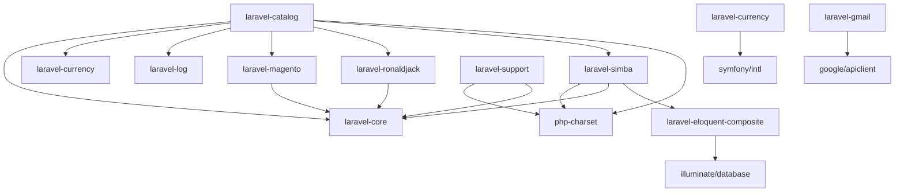

# Overview - Packages in diepxuan/

Thư mục `diepxuan/` chứa các package Laravel và PHP được phát triển cho hệ thống DXPanel và các dự án liên quan.

## Danh sách Package (14)

| STT | Package | Mô tả | Chức năng chính | Dependencies |
|-----|---------|-------|-----------------|--------------|
| 1 | [laravel-catalog](./laravel-catalog/README.md) | Catalog package cho DXPanel | Quản lý sản phẩm, danh mục, inventory, hệ thống; Tích hợp nhiều package | laravel-core, laravel-currency, laravel-log, laravel-magento, laravel-ronaldjack, laravel-simba, php-charset |
| 2 | [laravel-core](./laravel-core/README.md) | Core package cho DX System | Cung cấp ServiceProvider cốt lõi; Quản lý package; Tự động đăng ký commands/schedules | Không |
| 3 | [laravel-currency](./laravel-currency/README.md) | Package định dạng tiền tệ cho Blade | Directive `@currency`; Định dạng số tiền theo currency/locale | symfony/intl |
| 4 | [laravel-disreg](./laravel-disreg/README.md) | Package vô hiệu hóa đăng ký trong Laravel | Middleware chặn route `/register`; Trả về HTTP 403 | Không |
| 5 | [laravel-eloquent-composite](./laravel-eloquent-composite/README.md) | Package hỗ trợ khóa chính composite cho Eloquent | CompositeModel; Trait HasCompositePrimaryKey | illuminate/database |
| 6 | [laravel-gmail](./laravel-gmail/README.md) | Client Gmail tùy chỉnh cho Laravel | Tích hợp Google API Client; Gửi/nhận email qua Gmail API | google/apiclient |
| 7 | [laravel-log](./laravel-log/README.md) | Log custom channel cho Laravel | Ghi log theo channel vào file riêng; Hỗ trợ tất cả mức độ log | Không |
| 8 | [laravel-magento](./laravel-magento/README.md) | Tích hợp Laravel với Magento API OAuth 1.0 | Builder cho product, category, customer, order, store; Magento 2 API | laravel-core, guzzlehttp/guzzle, guzzlehttp/oauth-subscriber |
| 9 | [laravel-ronaldjack](./laravel-ronaldjack/README.md) | SDK Ronald Jack cho Laravel | Tích hợp máy chấm công qua COM; Thư viện zkemkeeper.dll | laravel-core |
| 10 | [laravel-scavenger](./laravel-scavenger/README.md) | Package web scraper tích hợp cho Laravel | Thu thập dữ liệu web (web scraping) | ext-iconv, ext-json, ext-dom |
| 11 | [laravel-simba](./laravel-simba/README.md) | Tích hợp Laravel với Simba | Model SModel (bảng dữ liệu Simba); Stored procedure caller | php-charset, laravel-core, laravel-eloquent-composite |
| 12 | [laravel-support](./laravel-support/README.md) | Package hỗ trợ và tiện ích cho Laravel | Collection::toMarkdownTable; Command npm tự động; Scheduling | php-charset, laravel-core |
| 13 | [php-charset](./php-charset/README.md) | Package chuyển đổi ký tự tiếng Việt | Chuyển đổi giữa các bảng mã: unicode, ascii, virq, vnet, vni | Không |

## Mối quan hệ phụ thuộc



## Phân loại

### Core & Infrastructure
- **laravel-core**: Nền tảng hệ thống
- **laravel-support**: Tiện ích hỗ trợ
- **laravel-log**: Logging
- **laravel-disreg**: Security

### Integration & API
- **laravel-magento**: Magento API
- **laravel-simba**: Simba ERP
- **laravel-gmail**: Gmail API
- **laravel-ronaldjack**: Thiết bị chấm công

### Data & Models
- **laravel-catalog**: Quản lý catalog
- **laravel-eloquent-composite**: Model với khóa chính composite

### Utilities
- **laravel-currency**: Định dạng tiền tệ
- **php-charset**: Chuyển đổi encoding
- **laravel-scavenger**: Web scraping

## Trạng thái phát triển

- **Đã hoạt động**: laravel-catalog, laravel-core, laravel-currency, laravel-disreg, laravel-eloquent-composite, laravel-log, laravel-magento, laravel-simba, laravel-support, php-charset
- **Đang phát triển/Chưa hoàn chỉnh**: laravel-gmail, laravel-scavenger
- **Platform-specific**: laravel-ronaldjack (chỉ Windows với COM)

## Hướng dẫn sử dụng

1. Thêm package vào project Laravel bằng composer:
   ```bash
   composer require diepxuan/<package-name>
   ```

2. Hầu hết package tự động đăng ký ServiceProvider (qua composer.json extra.laravel.providers).

3. Một số package cần cấu hình thêm (Magento OAuth, Gmail credentials).

4. Xem README chi tiết trong từng package.

## Ghi chú

- Các package được thiết kế để tái sử dụng trong hệ thống DXPanel và các dự án Laravel khác.
- Tuân thủ AI_AGENT_GUIDE.md (không sửa code, chỉ đọc và viết tài liệu).
- Tất cả README đã được cập nhật ngày 2026-02-11.

---

*Document generated by OpenClaw agent.*